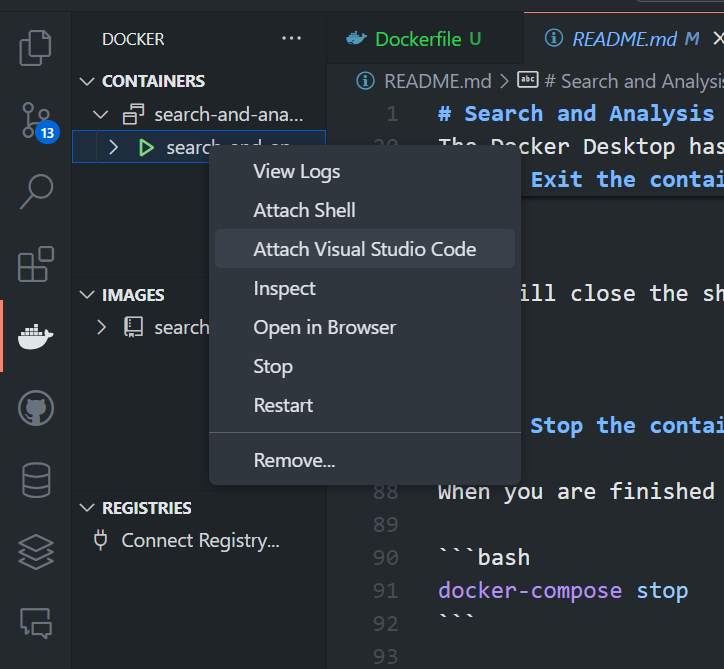
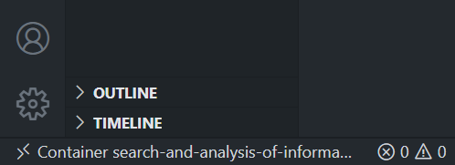

# Search and Analysis of Information
## Guide to Running and Executing the Container

This guide outlines the steps to run the container, access its shell, verify the Python installation, copy a folder from your local machine to the container, and stop the container when done.

---

### 1. Run the container

First install and open Docker Desktop. Once Docker Desktop is running, you can start the container by running the following command in your terminal:

```bash
docker-compose up -d
```

- The `-d` flag runs the container in "detached" mode, allowing it to run in the background.
- Ensure your terminal is in the same directory as the `docker-compose.yml` file.
  - If not, navigate to the directory containing the `docker-compose.yml` file before running the command. The `docker-compose.yml` and `Dockerfile` files should be in the same directory.

The Docker Desktop has to be running in order to execute the command. The container will take a few minutes to start up.
---

### 2. Open a shell in the container

Once the container is running, you can open an interactive shell inside the container by running:

```bash
docker exec -it elasticsearch /bin/bash
```

- **`-it`**: These flags enable interactive terminal mode.
- **`elasticsearch`**: This is the name of the running container.

---

#### 2.1 Verify Python version

After accessing the container shell, verify that Python 3.11 is installed by running:

```bash
python3.11 --version
```

This should display something like:

```
Python 3.11.x
```

---

#### 2.2 Copy the `CAI` folder to the container

To copy a folder from your local machine into the running container, use the following command in a separate terminal (not inside the container shell):

```bash
docker cp ./CAI elasticsearch:./
```

- **`./CAI`**: This is the path to the folder on your local machine that you want to copy.
- **`elasticsearch:./`**: This tells Docker to copy the folder into the root directory of the `elasticsearch` container.

Once copied, you can verify the folder was successfully transferred by checking the container’s file system from the shell:

```bash
cd /
ls -a
```

You should see the `CAI` folder listed in the directory.

---

#### 2.3. Exit the container shell

When you are done interacting with the container shell, you can exit by typing:

```bash
exit
```


This will close the shell but leave the container running in the background.

### 4. Open container environment in VSCode

To open the container environment in VSCode, in the docker extension, right click on the container and select "Attach Visual Studio Code".



Once inside the container, you can open the terminal by pressing `Ctrl + J`. To ensure that the container environment is working correctly, look at the left bottom corner of the VSCode window. It should show the name of the container you are working on.



#### 4.1 Install necessary extensions

To install the necessary extensions, click on the extensions icon on the left side of the window. Search for the following extensions and install them:

- Python
- Jupyter

And select the adequate Python interpreter to be able to run the notebooks.

---

### 5. Stop the container

When you are finished with the container, you can stop it by running the following command:

```bash
docker-compose stop
```

This will stop the container but keep it available for future use. 

Similarly, from the docker extension in VSCode, you can right click on the container and select "Stop".

---
